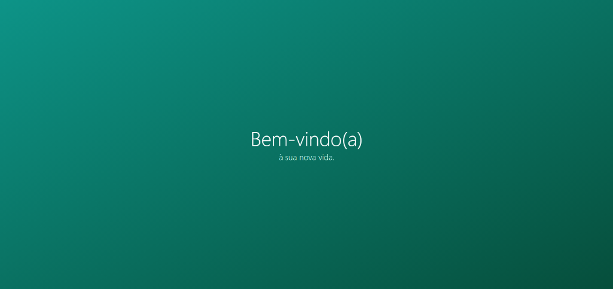
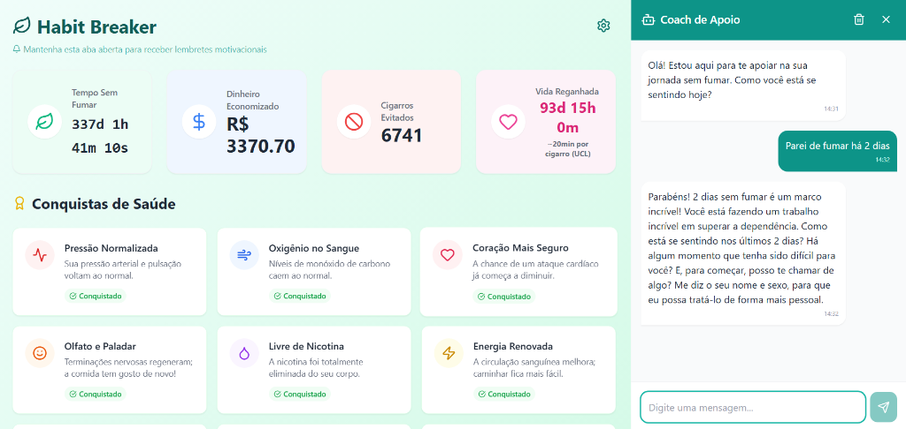
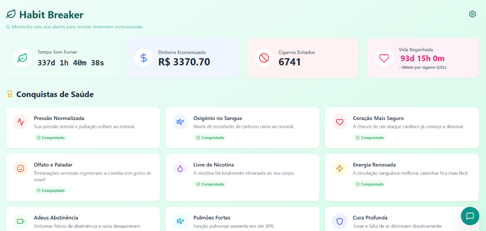
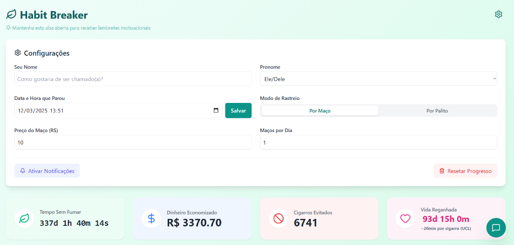

# 🍃 Habit Breaker

O **Habit Breaker** é uma aplicação web moderna e responsiva projetada para ajudar os usuários a pararem de fumar, visualizando seu progresso e fornecendo motivação em tempo real. Desenvolvido com **React**, **Vite** e **TailwindCSS**, possui um painel intuitivo e um coach alimentado por IA.



## 🚀 Funcionalidades

- **📊 Acompanhamento em Tempo Real**: Contador mostrando dias, horas, minutos e segundos sem fumar.
- **💰 Economia Gerada**: Calcula a economia exata com base nos seus hábitos específicos.
- **🚭 Cigarros Evitados**: Visualiza o impacto na saúde acompanhando os cigarros não fumados.
- **🤖 Coach de IA**: Chat integrado com **Groq AI** para fornecer suporte e conselhos durante os momentos de fissura.
- **✨ Configurações Flexíveis**: 
  - Acompanhamento por **Maço** ou **Palito**.
  - Definição precisa de data e hora em que parou.
  - Funcionalidade de reset inteligente.
- **📱 Design Responsivo**: Totalmente otimizado para experiências mobile e desktop.
- **🔔 Notificações Motivacionais**: Sistema "Good Vibes" para enviar mensagens encorajadoras (controlado pelo usuário).

## 📸 Capturas de Tela

| Tela de Boas-Vindas | Coach de Apoio | Configurações |
| :---: | :---: | :---: |
|  |  |  |

## 🛠️ Tecnologias Utilizadas

- **Frontend**: React (Vite)
- **Estilização**: TailwindCSS, Framer Motion (Animações)
- **Ícones**: Lucide React
- **Integração de IA**: API da Groq
- **Gerenciamento de Estado**: React Hooks + Persistência em LocalStorage

## 📦 Instalação

1.  Clone o repositório:
    ```bash
    git clone https://github.com/seu-usuario/habit-breaker.git
    cd habit-breaker
    ```

2.  Instale as dependências:
    ```bash
    npm install
    ```

3.  Inicie o servidor de desenvolvimento:
    ```bash
    npm run dev
    ```

4.  Abra o navegador em `http://localhost:5173`.

## ⚙️ Configuração

Para usar a funcionalidade do Coach de IA, gere uma chave de API gratuita no [Groq Console](https://console.groq.com) e insira-a nas configurações de chat do app.

## 🤝 Contribuição

Contribuições são bem-vindas! Sinta-se à vontade para enviar um Pull Request.

## 📄 Licença

Este projeto é código aberto e está disponível sob a [Licença MIT](LICENSE).
